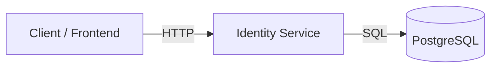
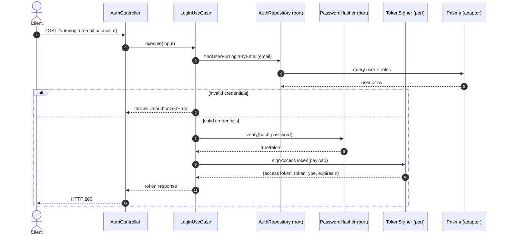

# identity-service

Boilerplate (boilerplate) de microserviço NestJS usando **Arquitetura Hexagonal** + **Prisma (PostgreSQL)**.

## Documentação (PT-BR)

### Versão em inglês

- Documentação em inglês: `docs/README.md`

### Sumário

- Visão geral
- Glossário
- Arquitetura (Hexagonal)
- Diagramas (Mermaid)
- API (documentação Swagger/autenticação/erros/paginação)
- Segurança (criptografia de dados pessoais/PII)
- Dicionário de dados (schema do banco)
- Operações (variáveis de ambiente/procedimentos operacionais/solução de problemas)

## Requisitos

- Node.js LTS
- Yarn
- Docker (opcional, para PostgreSQL)

## Instalação (local)

```bash
yarn
copy .env.example .env
docker compose up -d
yarn prisma:generate
yarn seed
```

## Executar

```bash
yarn start:dev
```

## Documentação Swagger

- **Interface do Swagger (Swagger UI)**: `http://localhost:3000/docs`
- Habilitar/desabilitar via `.env`: `SWAGGER_ENABLED=true|false`

## Segurança / modelagem da API

- Esta API **nunca expõe IDs numéricos do banco**.
- Todas as rotas usam **UUID** como identificador (`:uuid`) e as respostas retornam apenas `uuid`.
- `User.password` nunca é retornado pela API.

## Rotas (endpoints, CRUD, baseado em UUID)

Após iniciar a aplicação, as rotas CRUD (endpoints) estarão disponíveis em:

- `GET/POST /roles`, `GET/PATCH/DELETE /roles/:uuid`
- `GET/POST /companies`, `GET/PATCH/DELETE /companies/:uuid`
- `GET/POST /users`, `GET/PATCH/DELETE /users/:uuid`
- `GET/POST /teachers`, `GET/PATCH/DELETE /teachers/:uuid`

---

## Visão geral

### O que este serviço é

Este repositório (`identity-service`) implementa um serviço NestJS responsável por **autenticação e dados de identidade**:

- usuários e seus perfis
- papéis (roles) e checagens de autorização (baseado em papéis/roles)
- limites de acesso por empresa (quando aplicável)

Este serviço expõe uma API HTTP com documentação Swagger em tempo de execução.

### Responsabilidades (alto nível)

- **Autenticação**: login e emissão de token de acesso (JWT)
- **Autorização**: checagens por role aplicadas via guards (Nest)
- **Dados de identidade**: CRUD de papéis/empresas/usuários/professores (modelos `Role`/`Company`/`User`/`Teacher`, API baseada em UUID)

### Restrições e princípios

- **UUID-only API**: IDs numéricos do banco nunca são expostos externamente.
- **Arquitetura hexagonal**:
  - domain não depende de frameworks
  - application orquestra os use cases
  - entrypoints adaptam protocolos (HTTP)
  - infrastructure contém adapters (Prisma, crypto, JWT signing)

---

## Glossary (domain language)

Este glossário define os termos usados no serviço (código, banco e API).

### Identity terms

- **User**
  - Uma pessoa que pode autenticar na plataforma.
  - Possui `email` único.
  - Pode pertencer a uma empresa (`companyId`) dependendo do role.

- **Role**
  - Rótulo de autorização usado para proteger rotas (endpoints) e habilitar ações.
  - Atribuído a usuários através de `UserRole`.

- **Teacher**
  - Uma especialização vinculada a um usuário (`Teacher.userId -> User.id`).
  - Representa dados adicionais específicos de professor.

### Organizational terms

- **Company**
  - Organização / agrupamento tipo tenant.
  - Identificada por `companyId` (business identifier) e `uuid` (API identifier).

- **Enterprise user**
  - Usuário com role `ENTRERPRISE` (grafia conforme código/seed).
  - Usado como “limite corporativo/enterprise” em fluxos relacionados à empresa.

### Technical terms

- **Port**
  - Uma interface + token definida em `src/domain/ports`.
  - Consumida por use cases (`application`) e implementada por adapters (`infrastructure`).

- **Adapter**
  - Implementação concreta de um port (ex.: repositório Prisma, assinador JWT).

---

## Arquitetura (Hexagonal)

### Camadas

- **domain** (`src/domain`)
  - Conceitos de negócio puros: entidades/value objects/serviços de domínio
  - Sem NestJS, sem Prisma, sem HTTP

- **domain ports** (`src/domain/ports`)
  - Interfaces (ports) + DI tokens usados por `application` e implementados por `infrastructure`
  - Não pode depender de NestJS/Prisma/HTTP/nem de libs externas

- **application** (`src/application`)
  - Use cases + orquestração
  - Erros de aplicação (mapeados para HTTP pelos entrypoints)

- **entrypoints** (`src/entrypoints`)
  - Inbound adapters (HTTP controllers, message handlers)
  - Traduz entrada externa (HTTP DTOs) → chama `application`
  - Não monta DI/wiring (a injeção de dependências fica em `application`)
  - Traduz erros de aplicação → respostas HTTP (via filtros)

- **infrastructure** (`src/infrastructure`)
  - Outbound adapters (Prisma repositories, messaging clients, external SDKs)
  - Implementa ports de `domain`
  - Não acessa `application` nem `entrypoints`

### Por que ports ficam em `domain/ports`

Ports representam os “conectores” estáveis entre as camadas. Mantê-los em `domain/ports`:

- mantém `domain` independente de frameworks de infraestrutura (Nest/Prisma/HTTP)
- permite que `application` dependa apenas de contratos de `domain`
- habilita múltiplos adaptadores (Prisma, REST, dublês/mocks) sem mudar `application`/`domain`

---

## Diagrams (Mermaid)

Os diagramas abaixo estão em Mermaid para serem facilmente colados no Notion/Confluence.

### Contexto do sistema



### Visão interna (hexagonal)

```mermaid
flowchart TB
  subgraph Entry[entrypoints]
    HTTP[HTTP Controllers / DTOs]
    Seg[Auth guards]
  end

  subgraph App[application]
    CasosDeUso[Use cases]
    ErrosApp[Application errors]
  end

  subgraph Domain[domain]
    Entidades[Entities / Value Objects]
    Ports[Ports (interfaces + tokens)]
  end

  subgraph Infra[infrastructure]
    Prisma[Prisma repositories]
    Cripto[Crypto/Hasher services]
    JWT[JWT signer]
  end

  HTTP --> CasosDeUso
  Seg --> CasosDeUso
  CasosDeUso --> Entidades
  CasosDeUso --> Ports
  Prisma --> Ports
  Cripto --> Ports
  JWT --> Ports
  Prisma --> Postgres
```

### Fluxo de login (sequência)



---

## API

### Documentação Swagger

- Interface Swagger (Swagger UI): `http://localhost:3000/docs`
- Habilitar/desabilitar: `SWAGGER_ENABLED=true|false` (variável de ambiente)

### Autenticação

Esta API usa tokens **JWT Bearer**.

- Envie o token com `Authorization: Bearer <jwt>`
- Na interface do Swagger (Swagger UI), use o botão **Authorize** e cole o JWT (com ou sem o prefixo `Bearer `)

Rotas protegidas por `JwtAuthGuard` aparecem no Swagger com autenticação Bearer.

### Autorização (papéis/roles)

Restrições por role são aplicadas com:

- `@UseGuards(JwtAuthGuard, RolesGuard)`
- decorador `@Roles(...)`

### Tratamento de erros

Erros de aplicação são traduzidos para HTTP pelo `ApplicationErrorFilter`.

- `UnauthorizedError` → HTTP 401
- `BadRequestError` → HTTP 400
- `NotFoundError` → HTTP 404

### Paginação

As rotas de listagem usam `PaginationDto` (`skip`, `take`) via parâmetros de query.

### Visão geral das rotas (endpoints)

O serviço expõe rotas CRUD (endpoints) baseadas em UUID para:

- papéis (`/roles`)
- empresas (`/companies`)
- usuários (`/users`)
- professores (`/teachers`)

Para a lista completa e atualizada, consulte sempre a interface Swagger (Swagger UI).

---

## Segurança (criptografia em repouso)

### Modelo de ameaça (o que protegemos)

- Evitar vazamento de IDs numéricos do banco (mitigado pelo desenho da API somente com UUID)
- Proteger dados pessoais sensíveis (PII), como **CPF / personRegistrationNumber**, caso dumps, backups ou logs do banco sejam expostos

### Criptografia por coluna (gerenciada pela aplicação)

Criptografamos `User.personRegistrationNumber` **antes de gravar** no banco usando:

- **AES-256-GCM** (criptografia autenticada)
- **IV aleatório de 12 bytes** por valor
- Conteúdo criptografado armazenado como **base64(JSON({v,iv,ct,tag}))**

Configuração:

- `DATA_ENCRYPTION_KEY`: chave de 32 bytes, codificada em base64

Observações:

- Rotação de chave ainda não está implementada (futuro: chaves versionadas + job de recriptografia).
- Não logar valor em texto puro nem valor criptografado.
- Se `DATA_ENCRYPTION_KEY` estiver ausente, o serviço deve falhar rápido no startup.

### Hash determinístico para busca (HMAC)

Também armazenamos um hash determinístico com chave:

- `User.personRegistrationNumberHash` = HMAC-SHA256 (base64url) usando `DATA_ENCRYPTION_HMAC_KEY`

Isso permite:

- busca/deduplicação sem precisar descriptografar o CPF
- indexação eficiente para consultas

Ainda é dado sensível e não deve ser retornado pela API.

### Criptografia do banco (infraestrutura)

O código da aplicação não garante criptografia em nível de disco. Use uma das opções:

- Criptografia do banco gerenciada (ex.: AWS RDS / GCP Cloud SQL com criptografia em repouso)
- Criptografia de disco completo no host/VM
- Volumes criptografados para armazenamento Docker/VM

Além disso, use sempre **TLS** nas conexões com o banco em produção.

### Observação sobre Docker Compose

Este repositório configura o Postgres para **exigir TLS** (`hostssl` + `ssl=on`) para criptografar dados em trânsito.

Para **criptografia em repouso**, somente o Docker Compose não é suficiente — use discos/volumes criptografados no host/VM ou um banco gerenciado com garantias de criptografia em repouso.

---

## Dicionário de dados (PostgreSQL via Prisma)

Fonte da verdade: `prisma/schema.prisma`.

Convenções:

- A API usa **UUID** (`uuid`) como identificador externo; o `id` numérico é apenas interno.
- Timestamps no Postgres: colunas `created_at` / `updated_at` (no **Prisma Client** gerado, os campos aparecem como `createdAt` / `updatedAt`).

### Papel — tabela `role`

- **Chave primária**: `id` (autoincrement)
- **Identificador externo**: `uuid` (UUID, único)
- **Campos**
  - `name`: nome do papel (`Role`) único
  - `description`: texto opcional
  - `createdAt` / `updatedAt`
- **Relações**
  - um-para-muitos com `UserRole` (`Role.users`)

### Usuário — tabela `user`

- **Chave primária**: `id` (autoincrement)
- **Identificador externo**: `uuid` (UUID, único)
- **Campos**
  - `companyId`: identificador de negócio opcional (liga com `Company.companyId`)
  - `firstName`, `lastName`
  - `email`: único
  - `password`: hash de senha (nunca retornado pela API)
  - `personRegistrationNumber`: dados pessoais sensíveis (PII) criptografados (veja a seção de Segurança acima)
  - `personRegistrationNumberHash`: hash determinístico para busca/indexação
  - `createdAt` / `updatedAt`
- **Índices**
  - `companyId`
  - `personRegistrationNumberHash`
- **Relações**
  - muitos-para-um opcional com `Company` via `companyId` (ao excluir: definir como null)
  - um-para-muitos com `UserRole`
  - um-para-muitos com `UserCompany`
  - um-para-um opcional com `Teacher`

### Empresa — tabela `company`

- **Chave primária**: `id` (autoincrement)
- **Identificador externo**: `uuid` (UUID, único)
- **Identificador de negócio**: `companyId` (único, referenciado por `User.companyId`)
- **Campos**
  - `name`
  - `companyRegistrationNumber`
  - `createdAt` / `updatedAt`
- **Relações**
  - um-para-muitos com `User` via relação `companyId`
  - um-para-muitos com `UserCompany`

### Vínculo usuário–papel — tabela `user_role`

- **Chave primária**: `id` (autoincrement)
- **Identificador externo**: `uuid` (UUID, único)
- **Campos**
  - `userId` (FK → `User.id`)
  - `roleId` (FK → `Role.id`)
  - `createdAt` / `updatedAt`
- **Restrições**
  - único (`userId`, `roleId`) para evitar duplicatas
- **Relações**
  - muitos-para-um com `User` (exclusão em cascata)
  - muitos-para-um com `Role` (exclusão em cascata)

### Vínculo usuário–empresa — tabela `user_company`

- **Chave primária**: `id` (autoincrement)
- **Identificador externo**: `uuid` (UUID, único)
- **Campos**
  - `userId` (FK → `User.id`)
  - `companyId` (FK → `Company.id`)
  - `createdAt` / `updatedAt`
- **Restrições**
  - único (`userId`, `companyId`) para evitar duplicatas
- **Relações**
  - muitos-para-um com `User` (exclusão em cascata)
  - muitos-para-um com `Company` (exclusão em cascata)

### Professor — tabela `teacher`

- **Chave primária**: `id` (autoincrement)
- **Identificador externo**: `uuid` (UUID, único)
- **Campos**
  - `userId`: FK única → `User.id` (garante 1:1)
  - `subject` (disciplina)
  - `createdAt` / `updatedAt`
- **Relações**
  - um-para-um com `User` (exclusão em cascata)

---

## Operações

### Desenvolvimento local

Requisitos:

- Node.js LTS
- Yarn
- Docker (opcional, para PostgreSQL)

Configuração inicial:

```bash
yarn
copy .env.example .env
docker compose up -d
yarn prisma:generate
yarn seed
```

Executar:

```bash
yarn start:dev
```

### Variáveis de ambiente

Veja `.env.example` para a lista completa. Principais variáveis:

- `PORT`: porta HTTP (padrão 3000)
- `SWAGGER_ENABLED`: habilita `/docs`
- `DATABASE_URL`: string de conexão do Postgres
- `JWT_SECRET`: segredo de assinatura do JWT
- `JWT_EXPIRES_IN`: expiração do token (ex.: `15m`)
- `DATA_ENCRYPTION_KEY`: chave para criptografar campos sensíveis
- `DATA_ENCRYPTION_HMAC_KEY`: chave para HMAC determinístico

### Fluxos do banco de dados

- Gerar o Prisma Client: `yarn prisma:generate`
- Migrations (desenvolvimento): `yarn prisma:migrate:dev`
- Migrations (implantação / CI): `yarn prisma:migrate:deploy`
- Seed (dados iniciais): `yarn seed`

### Solução de problemas

#### Porta já em uso

Se aparecer `EADDRINUSE :::3000`, outro processo está usando a porta configurada.

- pare o servidor dev em execução
- ou altere `PORT` para outro valor

#### Documentação Swagger indisponível

- garanta `SWAGGER_ENABLED=true`
- confirme que o serviço está rodando e escutando na porta esperada

#### Erro de injeção de dependências do JWT (`JwtService` não resolvido)

Isso acontece se o `JwtModule` não estiver disponível onde o `JwtTokenSignerService` é provido.
A arquitetura atual conecta a assinatura de JWT no `InfrastructureModule`.
