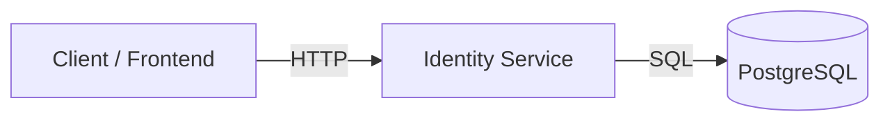
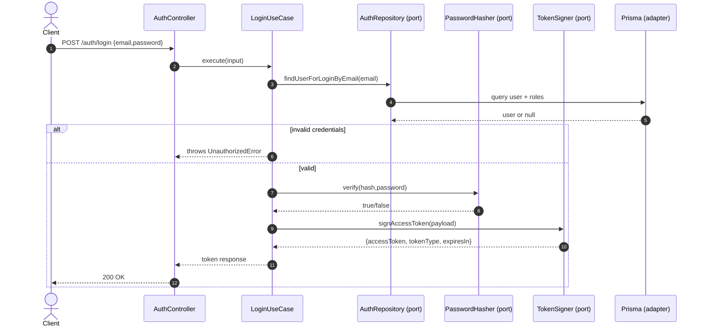

## Diagrams

All diagrams below are written in Mermaid so they can be pasted into Notion/Confluence later.

### System context



### Hexagonal container view (internal)

```mermaid
flowchart TB
  subgraph Entry[entrypoints]
    HTTP[HTTP Controllers / DTOs]
    Filters[Exception filters]
    Guards[Auth guards]
  end

  subgraph App[application]
    UseCases[Use cases]
    AppErrors[Application errors]
  end

  subgraph Domain[domain]
    Entities[Entities / Value Objects]
    Ports[Ports (interfaces + tokens)]
  end

  subgraph Infra[infrastructure]
    Prisma[Prisma repositories]
    Crypto[Crypto/Hasher services]
    JWT[JWT signer]
  end

  HTTP --> UseCases
  Guards --> UseCases
  UseCases --> Entities
  UseCases --> Ports
  Prisma --> Ports
  Crypto --> Ports
  JWT --> Ports
  Prisma --> Postgres
```

### Login flow (sequence)



